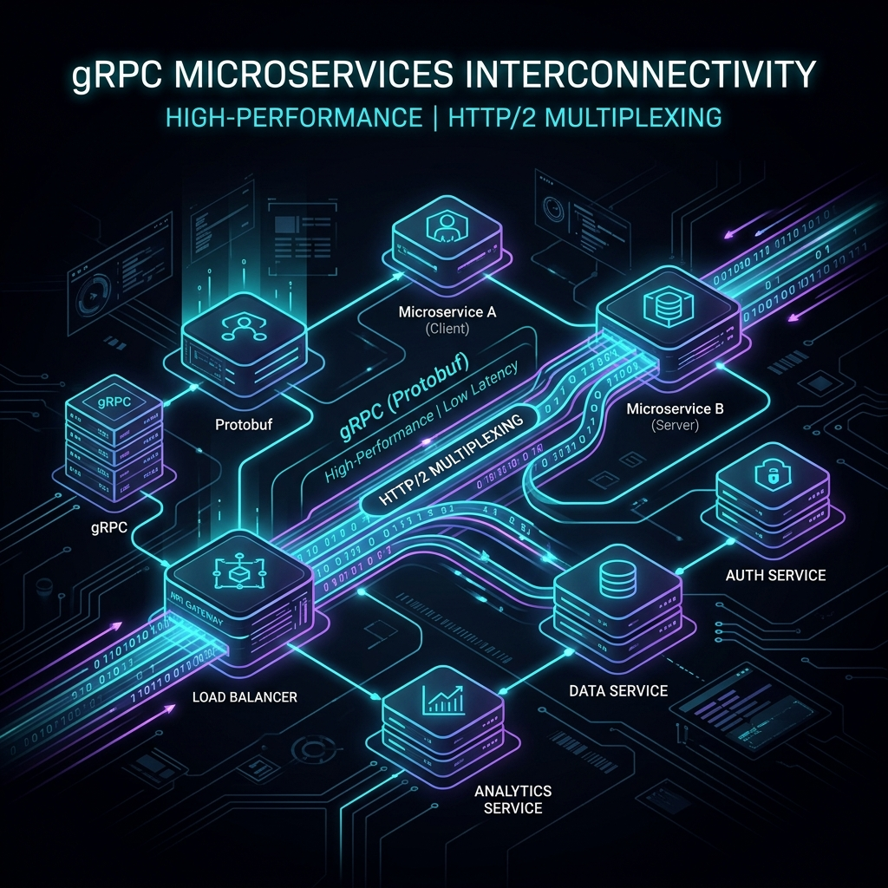
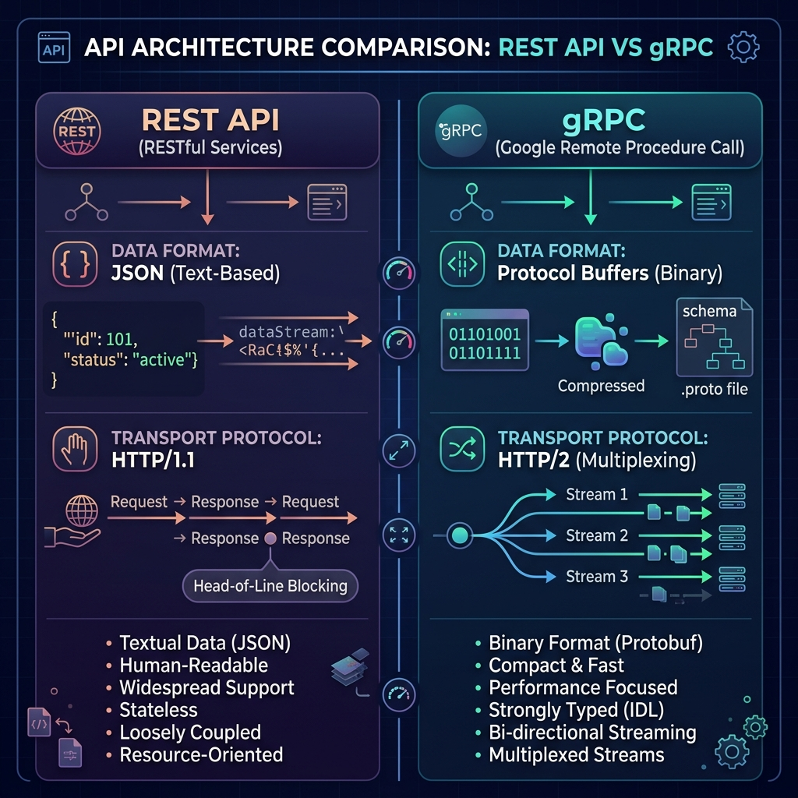
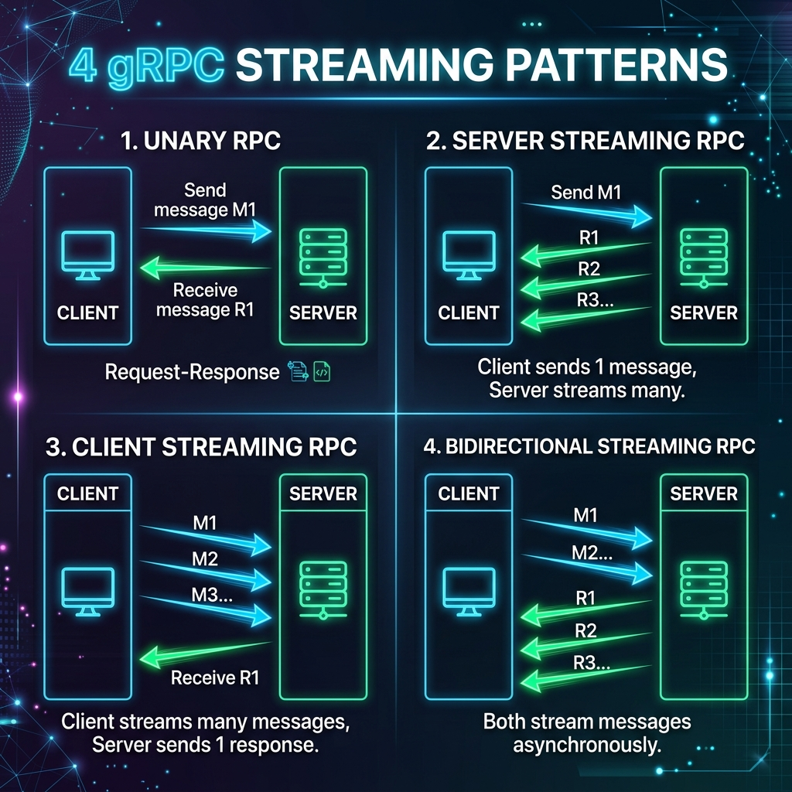

# Mastering gRPC in Microservices: From Core Architecture to Production Implementation in Node.js & NestJS

> **Subtitle:** Discover how Google's high-performance framework replaces legacy REST APIs, delivers 10x throughput with Protocol Buffers and HTTP/2 multiplexing, and implement all 4 streaming communication models with production-grade error handling, Envoy L7 proxy, and Kubernetes health probes in Node.js and NestJS.

---



## Introduction: The Microservice Communication Bottleneck

In modern cloud-native software engineering, microservice architectures have become the de facto standard for building scalable applications. However, as distributed systems expand from tens to hundreds of decoupled services, **inter-service communication (East-West traffic)** rapidly becomes the primary performance bottleneck.

For decades, **REST (Representational State Transfer)** over **HTTP/1.1** paired with **JSON (JavaScript Object Notation)** has reigned supreme. While REST is incredibly developer-friendly, human-readable, and ubiquitous for public client-to-server APIs (North-South traffic), it incurs severe overhead for internal microservice chatter:

1. **Textual Serialization Overhead:** JSON strings must be parsed and serialized on every request/response cycle, burning CPU cycles and ballooning payload sizes.
2. **HTTP/1.1 Head-of-Line (HoL) Blocking:** Each HTTP/1.1 TCP connection can process only one request-response pair at a time, requiring expensive connection pooling or causing request queue latency.
3. **Weak API Contracts:** REST lacks built-in schema enforcement out of the box, leading to runtime data shape mismatches between services.

Enter **gRPC (Google Remote Procedure Call)**—a modern, open-source, high-performance RPC framework originally developed by Google. gRPC enables client and server applications to communicate transparently, making inter-service calls feel as effortless as calling a local function in memory.

---

## Architectural Deep Dive: What Makes gRPC Blazingly Fast?

gRPC derives its raw speed, low latency, and efficiency from two core underlying technologies: **Protocol Buffers (Protobuf)** and **HTTP/2**.



### 1. Protocol Buffers (Binary Serialization)
Unlike JSON or XML, which serialize data into verbose human-readable text strings, Protocol Buffers compress data into a compact binary format. 

Field names are stripped out during serialization and replaced with lightweight integer field tags (`1`, `2`, `3`). This dramatically shrinks the payload size—frequently reducing message sizes by **60% to 80%** compared to JSON.

### 2. HTTP/2 Transport & Multiplexing
gRPC relies exclusively on **HTTP/2** as its transport protocol, unlocking critical networking capabilities:
* **Multiplexing over a Single TCP Connection:** Multiple requests and responses can be sent concurrently over a single long-lived TCP connection without head-of-line blocking.
* **Header Compression (HPACK):** HTTP headers are compressed using HPACK algorithms, reducing HTTP metadata overhead.
* **Bi-directional Streaming:** Client and server can push streams of messages asynchronously over the same persistent channel.

---

## Head-to-Head Comparison: REST vs. gRPC

| Feature | REST API | gRPC |
| :--- | :--- | :--- |
| **Protocol** | HTTP/1.1 (HTTP/2 optional) | HTTP/2 (Mandatory) |
| **Payload Format** | JSON, XML (Text-based) | Protocol Buffers (Binary) |
| **Contract / Schema** | Optional (OpenAPI / Swagger) | Strict, Required (`.proto` IDL) |
| **Code Generation** | Third-party tooling | Built-in via `protoc` compiler |
| **Streaming** | Limited (Server-Sent Events, WebSockets) | Native Support (Unary, Client, Server, Bi-directional) |
| **Performance** | Medium / High Payload Overhead | High Throughput / Ultra-low Latency |
| **Best Use Case** | Public Web / Mobile Facing APIs | Internal Microservice Communication |

---

## The 4 gRPC Communication Patterns

Unlike traditional REST APIs that are strictly tied to single request-response semantics, gRPC natively supports **4 distinct communication models**:



1. **Unary RPC:** The traditional request-response model. The client sends a single request message and receives a single response message.
2. **Server Streaming RPC:** The client sends one request message to the server and receives a stream of multiple response messages back. Ideal for live telemetry, logs, or large file downloads.
3. **Client Streaming RPC:** The client writes a sequence of multiple request messages and sends them to the server as a stream. Once completed, the server responds with a single summary message. Ideal for metrics collection, bulk uploads, or IoT sensor telemetry.
4. **Bidirectional Streaming RPC:** Both client and server send a sequence of messages using a read-write stream. The two streams operate independently, enabling real-time chat, multiplayer state sync, and interactive push notifications.

---

## Hands-On Implementation: Code Architecture Overview

To demonstrate how gRPC works in production, we provide complete runnable reference code for both **Node.js** and **NestJS**.

### Production Repository Directory Structure

```
grpc-guide/
├── README.md                   # Complete Article
├── assets/                     # Architecture & Flow Diagrams
└── code/                       # Production Source Code
    ├── proto/
    │   └── hero.proto          # Protobuf Interface Definition Language (IDL)
    ├── config/
    │   ├── envoy.yaml          # Production Envoy L7 Proxy Configuration
    │   └── k8s-deployment.yaml # Kubernetes Deployment Manifest with gRPC Probes
    ├── nodejs-demo/            # Pure Node.js Implementation (@grpc/grpc-js)
    │   ├── package.json
    │   ├── server/server.js    # Node.js Server with Status Codes & Graceful Shutdown
    │   └── client/client.js
    └── nestjs-demo/            # NestJS Microservice Implementation
        ├── package.json
        └── src/
            ├── main.ts
            ├── app.module.ts
            ├── common/
            │   ├── filters/grpc-exception.filter.ts   # Global gRPC Exception Filter
            │   └── interceptors/logging.interceptor.ts# Request Telemetry Interceptor
            └── hero/
                ├── hero.module.ts
                └── hero.controller.ts
```

---

## 1. Defining the Contract (`hero.proto`)

Everything in gRPC starts with a `.proto` file. This contract acts as the single source of truth for both server and client implementations.

```protobuf
syntax = "proto3";

package hero;

// Service definition showcasing all 4 RPC communication patterns
service HeroService {
  // 1. Unary RPC
  rpc GetHero (HeroRequest) returns (HeroResponse);

  // 2. Server Streaming RPC
  rpc StreamHeroPowers (HeroRequest) returns (stream PowerResponse);

  // 3. Client Streaming RPC
  rpc CollectBattleMetrics (stream BattleMetric) returns (BattleSummary);

  // 4. Bidirectional Streaming RPC
  rpc HeroLiveChat (stream ChatMessage) returns (stream ChatMessage);
}

// Data Messages
message HeroRequest {
  string hero_id = 1;
}

message HeroResponse {
  string hero_id = 1;
  string name = 2;
  string alias = 3;
  int32 power_level = 4;
  repeated string abilities = 5;
}

message PowerResponse {
  string power_name = 1;
  int32 intensity = 2;
  string status = 3;
}

message BattleMetric {
  string battle_id = 1;
  int32 damage_dealt = 2;
  int32 damage_taken = 3;
  int64 timestamp = 4;
}

message BattleSummary {
  string battle_id = 1;
  int32 total_damage_dealt = 2;
  int32 total_damage_taken = 3;
  string combat_rating = 4;
}

message ChatMessage {
  string sender = 1;
  string message = 2;
  int64 timestamp = 3;
}
```

---

## 2. Implementing gRPC in Pure Node.js (`@grpc/grpc-js`)

### Node.js Production gRPC Server (`nodejs-demo/server/server.js`)

In pure Node.js, production servers must implement **gRPC Status Codes** (`grpc.status`) and **Graceful Shutdown** (`SIGINT`/`SIGTERM` hooks):

```javascript
const path = require('path');
const grpc = require('@grpc/grpc-js');
const protoLoader = require('@grpc/proto-loader');

const PROTO_PATH = path.join(__dirname, '../../proto/hero.proto');

const packageDefinition = protoLoader.loadSync(PROTO_PATH, {
  keepCase: true,
  longs: String,
  enums: String,
  defaults: true,
  oneofs: true,
});

const heroProto = grpc.loadPackageDefinition(packageDefinition).hero;

// 1. Unary RPC Handler with Error Handling & Status Codes
function getHero(call, callback) {
  const { hero_id } = call.request;

  if (!hero_id || hero_id.trim() === '') {
    return callback({
      code: grpc.status.INVALID_ARGUMENT,
      message: 'Parameter hero_id must be specified and non-empty.',
    });
  }

  const hero = heroesDb.get(hero_id);
  if (!hero) {
    return callback({
      code: grpc.status.NOT_FOUND,
      message: `Hero record with ID "${hero_id}" does not exist.`,
    });
  }

  callback(null, hero);
}

// Graceful Shutdown Handler for Kubernetes
function main() {
  const server = new grpc.Server();
  server.addService(heroProto.HeroService.service, { getHero, ... });

  const PORT = process.env.PORT || '0.0.0.0:50051';
  server.bindAsync(PORT, grpc.ServerCredentials.createInsecure(), (err, port) => {
    if (err) process.exit(1);
    console.log(`🚀 Production gRPC Server running on ${PORT}`);
  });

  const shutdown = (signal) => {
    console.log(`🛑 ${signal} received. Draining connections...`);
    server.tryShutdown(() => process.exit(0));
  };

  process.on('SIGINT', () => shutdown('SIGINT'));
  process.on('SIGTERM', () => shutdown('SIGTERM'));
}

main();
```

---

## 3. Implementing Production gRPC in NestJS (`@nestjs/microservices`)

NestJS abstracts gRPC implementation into high-level decorators (`@GrpcMethod` and `@GrpcStreamMethod`), global Exception Filters, and **RxJS Observables**.

### Global gRPC Exception Filter (`nestjs-demo/src/common/filters/grpc-exception.filter.ts`)

Standard HTTP exceptions must be mapped into gRPC Status Codes for proper client consumption:

```typescript
import { Catch, RpcExceptionFilter, ArgumentsHost, HttpStatus } from '@nestjs/common';
import { RpcException } from '@nestjs/microservices';
import { Observable, throwError } from 'rxjs';
import { status as gRPCStatus } from '@grpc/grpc-js';

@Catch()
export class ProductionGrpcExceptionFilter implements RpcExceptionFilter<RpcException> {
  catch(exception: any, host: ArgumentsHost): Observable<any> {
    let grpcCode: gRPCStatus = gRPCStatus.INTERNAL;
    let message = exception.message || 'Internal Server Error';

    if (exception.status === HttpStatus.NOT_FOUND || exception.name === 'NotFoundException') {
      grpcCode = gRPCStatus.NOT_FOUND;
    } else if (exception.status === HttpStatus.BAD_REQUEST || exception.name === 'BadRequestException') {
      grpcCode = gRPCStatus.INVALID_ARGUMENT;
    } else if (exception.status === HttpStatus.UNAUTHORIZED) {
      grpcCode = gRPCStatus.UNAUTHENTICATED;
    }

    return throwError(() => ({
      code: grpcCode,
      message: message,
    }));
  }
}
```

### NestJS Controller (`nestjs-demo/src/hero/hero.controller.ts`)

```typescript
import { Controller, UseFilters, UseInterceptors } from '@nestjs/common';
import { GrpcMethod, GrpcStreamMethod, RpcException } from '@nestjs/microservices';
import { Observable, Subject, from } from 'rxjs';
import { status as gRPCStatus } from '@grpc/grpc-js';

@Controller()
@UseInterceptors(LoggingInterceptor)
@UseFilters(ProductionGrpcExceptionFilter)
export class HeroController {

  @GrpcMethod('HeroService', 'GetHero')
  getHero(data: { hero_id: string }) {
    if (!data.hero_id) {
      throw new RpcException({
        code: gRPCStatus.INVALID_ARGUMENT,
        message: 'Hero ID is required.',
      });
    }

    return {
      hero_id: data.hero_id,
      name: 'Spider-Man',
      alias: 'Peter Parker',
      power_level: 88,
      abilities: ['Spider-Sense', 'Web Shooting'],
    };
  }

  @GrpcStreamMethod('HeroService', 'HeroLiveChat')
  heroLiveChat(data$: Observable<any>): Observable<any> {
    const subject = new Subject<any>();

    data$.subscribe({
      next: (msg) => {
        subject.next({
          sender: 'NestJS AI Engine',
          message: `Received: "${msg.message}"`,
          timestamp: Date.now(),
        });
      },
      complete: () => subject.complete(),
    });

    return subject.asObservable();
  }
}
```

---

## 4. Production Infrastructure: Load Balancing & Kubernetes

### Canonical gRPC Error Codes Mapping

| gRPC Status Code | HTTP Equivalent | Scenario / Cause |
| :--- | :--- | :--- |
| `OK (0)` | 200 OK | Request succeeded |
| `INVALID_ARGUMENT (3)` | 400 Bad Request | Client specified invalid payload / arguments |
| `NOT_FOUND (5)` | 404 Not Found | Requested entity was not found |
| `PERMISSION_DENIED (7)` | 403 Forbidden | Authenticated user lacks permission |
| `UNAUTHENTICATED (16)` | 401 Unauthorized | Missing or invalid auth token / cert |
| `UNAVAILABLE (14)` | 503 Service Unavailable | Service pod is restarting or overloaded |
| `INTERNAL (13)` | 500 Internal Server Error | Unhandled server panic or crash |

---

### Layer-7 Load Balancing with Envoy Proxy (`code/config/envoy.yaml`)

Because gRPC keeps HTTP/2 TCP streams open indefinitely, traditional Layer 4 (L4) load balancers send all traffic to a single container instance. 

Using **Envoy L7 Proxy**, incoming requests are round-robined per-stream across backend microservice pods:

```yaml
static_resources:
  listeners:
    - name: grpc_listener
      address: { socket_address: { address: 0.0.0.0, port_value: 8080 } }
      filter_chains:
        - filters:
            - name: envoy.filters.network.http_connection_manager
              typed_config:
                stat_prefix: grpc_json
                route_config:
                  virtual_hosts:
                    - name: local_service
                      domains: ["*"]
                      routes:
                        - match: { prefix: "/" }
                          route: { cluster: hero_grpc_service }
                http_filters:
                  - name: envoy.filters.http.grpc_web
                  - name: envoy.filters.http.router
  clusters:
    - name: hero_grpc_service
      connect_timeout: 0.25s
      type: LOGICAL_DNS
      lb_policy: ROUND_ROBIN
      typed_extension_protocol_options:
        envoy.extensions.upstreams.http.v3.HttpProtocolOptions:
          explicit_http_config:
            http2_protocol_options: {}
```

---

### Kubernetes Native gRPC Health Probes (`code/config/k8s-deployment.yaml`)

Modern Kubernetes deployments (v1.24+) natively support `grpc` health checks using standard `grpc_health_v1`:

```yaml
apiVersion: apps/v1
kind: Deployment
metadata:
  name: hero-grpc-service
spec:
  replicas: 3
  template:
    spec:
      containers:
        - name: grpc-server
          image: myregistry/hero-grpc-service:v1.0.0
          ports:
            - name: grpc
              containerPort: 50051
          livenessProbe:
            grpc:
              port: 50051
            initialDelaySeconds: 10
            periodSeconds: 10
          readinessProbe:
            grpc:
              port: 50051
            initialDelaySeconds: 5
            periodSeconds: 5
```

---

## Conclusion & Key Takeaways

gRPC represents a massive paradigm shift for microservice architectures:

* 🚀 **10x Performance Boost:** Protocol Buffers binary serialization drastically shrinks payload size and reduces CPU overhead.
* ⚡ **HTTP/2 Efficiency:** Multiplexing over single TCP streams eliminates connection bottlenecks.
* 🛡️ **Strongly Typed Contracts:** `.proto` files eliminate client/server runtime data structure bugs.
* 🔄 **Versatile Streaming:** Native support for real-time bidirectional streaming.
* 🏭 **Enterprise Production Readiness:** Built-in support for Envoy L7 load balancing, mTLS, and Kubernetes `grpc_health_v1` probes.

By adopting gRPC for internal inter-service communication in Node.js and NestJS, engineering teams unlock exceptional throughput, reduce infrastructure costs, and enforce type safety across distributed systems.

---

*Code examples and runnable samples are available in the accompanying repository.*
