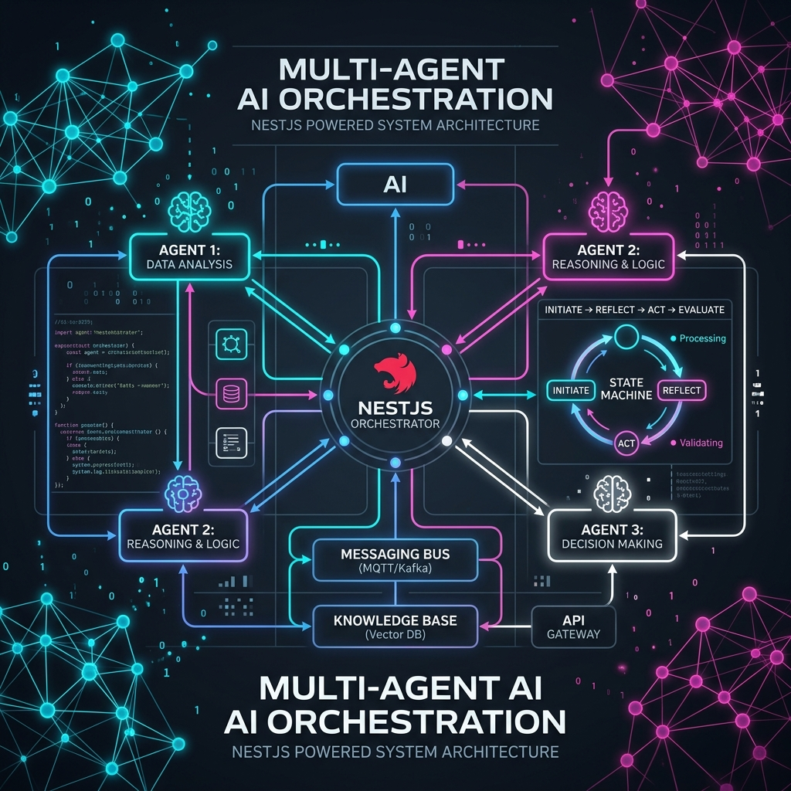
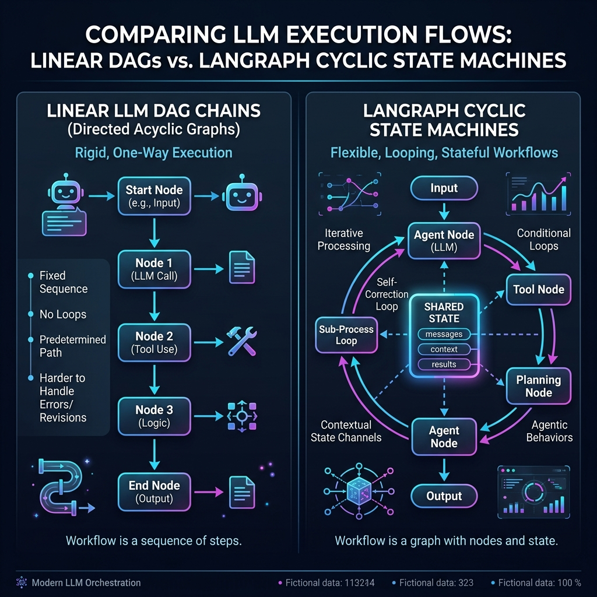
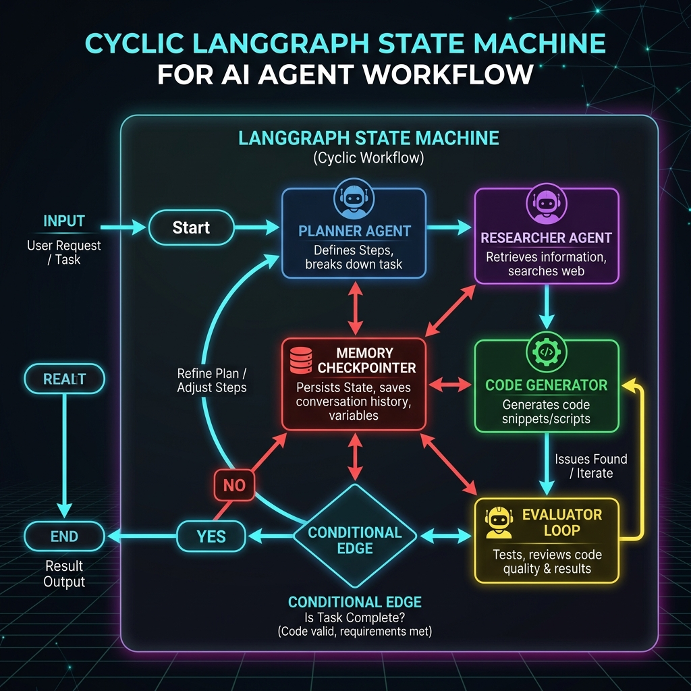

# Architecting Multi-Agent Systems with LangGraph & NestJS: State Machines in Action

> **Subtitle:** Discover how to move beyond rigid, linear LLM chains to build resilient, self-correcting multi-agent AI state machines using LangGraph.js and NestJS with real-time SSE streaming.

---



## Introduction: Why Single-Prompt LLMs Fall Short

Large Language Models (LLMs) have evolved beyond simple text completion engines into decision-making reasoning cores. However, attempting to solve complex, multi-step engineering tasks—such as code generation with security audits, technical research synthesis, or autonomous system design—using a single, massive LLM prompt quickly runs into critical failure modes:

1. **Context Window Contamination:** Jamming instructions, documentation, search results, and code into one prompt dilutes reasoning accuracy.
2. **Lack of Error Recovery & Self-Correction:** When an LLM produces flawed code or incorrect data in a single turn, there is no built-in mechanism to detect the error and self-correct.
3. **Rigid Execution Pathways:** Traditional LLM chains (like early LangChain DAGs) execute strictly from step A to B to C. They cannot loop back to step A if step B fails validation.

Enter **Multi-Agent Systems powered by State Machines**. By breaking down complex workflows into specialized autonomous agents—each with clear responsibilities, distinct prompts, and isolated tools—we can construct resilient, cyclic agentic loops.

In this guide, we will explore how to architect production-grade Multi-Agent Systems using **LangGraph.js** and **NestJS**.

---

## Architectural Paradigm: Linear DAGs vs. Cyclic State Machines

To understand why **LangGraph** is a game-changer for agentic AI, we must compare traditional linear execution with cyclic state machines.



### 1. Linear DAG Chains (Rigid & One-Way)
In traditional Directed Acyclic Graphs (DAGs), execution flows sequentially in one direction (`Node 1 -> Node 2 -> Node 3`). If Node 3 detects a bug in the output of Node 1, it cannot route execution back to Node 1 for correction without terminating the process or wrapping everything in custom `while` loops.

### 2. LangGraph Cyclic State Machines (Flexible & Stateful)
LangGraph models agent workflows as **State Graphs** (`StateGraph`). 
* **Shared State Channels:** All agent nodes read from and write to a single, typed state object (`StateAnnotation`).
* **Cyclic Loops:** Edges can point backwards, enabling iterative refinement loops (e.g., `Writer -> Evaluator -> Writer`).
* **Conditional Edge Routing:** Dynamic routing functions decide the next node based on current state attributes (e.g., quality ratings or validation checks).

---

## State Machine Architecture: The 4-Agent Execution Loop

Below is the architectural diagram of the Multi-Agent System implemented in this repository:



The workflow consists of **4 specialized Agent Nodes**:

1. **Planner Agent Node (`planner`):** Takes raw user requests and breaks them down into an ordered array of execution steps.
2. **Researcher Agent Node (`researcher`):** Gathers external context, API documentation, or database knowledge required to fulfill the plan.
3. **Writer Agent Node (`writer`):** Consumes the research data and plan to generate code snippets, documentation, or technical answers.
4. **Evaluator Agent Node (`evaluator`):** Inspects the draft for quality, syntax correctness, and requirement fulfillment.
   - **Conditional Decision:** If `rating >= 8`, execution routes to `END`.
   - **Feedback Loop:** If `rating < 8`, the conditional edge routes back to the **Writer Node** for iterative refinement.

---

## Hands-On Code Walkthrough: NestJS & LangGraph.js

The code in this repository is organized into a clean NestJS architecture:

```
langgraph-multi-agent/
├── README.md                   # Complete Article
├── LINKEDIN_POST.md            # Social Share Template
├── assets/                     # Architectural Diagrams
└── code/                       # NestJS + LangGraph Source Code
    ├── package.json
    └── src/
        ├── main.ts             # NestJS Server Entry Point
        ├── app.module.ts
        └── agents/
            ├── state/
            │   └── agent-state.ts          # StateAnnotation Schema
            ├── nodes/
            │   ├── planner.node.ts           # Planner Agent Node
            │   ├── researcher.node.ts        # Researcher Agent Node
            │   ├── writer.node.ts            # Writer Agent Node
            │   └── evaluator.node.ts         # Evaluator Node & Conditional Routing
            ├── graph/
            │   └── multi-agent.graph.ts    # StateGraph Assembly & Compilation
            ├── agent.controller.ts           # REST API & SSE Real-Time Streaming
            └── agent.module.ts
```

---

### 1. Defining Shared Channel State (`src/agents/state/agent-state.ts`)

In LangGraph.js, channel reducers define how new data returned by nodes merges into the global state:

```typescript
import { Annotation } from '@langchain/langgraph';
import { BaseMessage } from '@langchain/core/messages';

export const AgentStateAnnotation = Annotation.Root({
  // Accumulate messages using array concatenation
  messages: Annotation<BaseMessage[]>({
    reducer: (x, y) => x.concat(y),
    default: () => [],
  }),
  task: Annotation<string>({
    reducer: (x, y) => y ?? x,
    default: () => '',
  }),
  plan: Annotation<string[]>({
    reducer: (x, y) => y ?? x,
    default: () => [],
  }),
  researchData: Annotation<string>({
    reducer: (x, y) => (x ? `${x}\n${y}` : y),
    default: () => '',
  }),
  draft: Annotation<string>({
    reducer: (x, y) => y ?? x,
    default: () => '',
  }),
  evaluatorRating: Annotation<number>({
    reducer: (x, y) => y ?? x,
    default: () => 0,
  }),
  iterationCount: Annotation<number>({
    reducer: (x, y) => (x ?? 0) + (y ?? 1),
    default: () => 0,
  }),
  isComplete: Annotation<boolean>({
    reducer: (x, y) => y ?? x,
    default: () => false,
  }),
});

export type AgentState = typeof AgentStateAnnotation.State;
```

---

### 2. Assembling the StateGraph (`src/agents/graph/multi-agent.graph.ts`)

We combine nodes, directed edges, and conditional routing into a compiled runnable graph:

```typescript
import { StateGraph, START, END } from '@langchain/langgraph';
import { AgentStateAnnotation } from '../state/agent-state';
import { plannerNode } from '../nodes/planner.node';
import { researcherNode } from '../nodes/researcher.node';
import { writerNode } from '../nodes/writer.node';
import { evaluatorNode, shouldContinue } from '../nodes/evaluator.node';

export function buildMultiAgentGraph() {
  const workflow = new StateGraph(AgentStateAnnotation)
    // 1. Add Agent Nodes
    .addNode('planner', plannerNode)
    .addNode('researcher', researcherNode)
    .addNode('writer', writerNode)
    .addNode('evaluator', evaluatorNode)

    // 2. Add Fixed Edges
    .addEdge(START, 'planner')
    .addEdge('planner', 'researcher')
    .addEdge('researcher', 'writer')
    .addEdge('writer', 'evaluator')

    // 3. Add Conditional Edge for Self-Correction Feedback Loop
    .addConditionalEdges('evaluator', shouldContinue, {
      writer: 'writer',
      __end__: END,
    });

  return workflow.compile();
}
```

---

### 3. NestJS Controller & Real-Time SSE Streaming (`src/agents/agent.controller.ts`)

To provide real-time visibility into agent execution, we expose a **Server-Sent Events (SSE)** endpoint in NestJS that streams graph state updates as each node executes:

```typescript
import { Controller, Post, Body, Sse, MessageEvent } from '@nestjs/common';
import { Observable, Subject } from 'rxjs';
import { buildMultiAgentGraph } from './graph/multi-agent.graph';

@Controller('agents')
export class AgentController {
  private readonly appGraph = buildMultiAgentGraph();

  @Sse('stream')
  streamAgentWorkflow(@Body() body: { task: string }): Observable<MessageEvent> {
    const subject = new Subject<MessageEvent>();
    const task = body?.task || 'Architect Multi-Agent Systems in NestJS';

    (async () => {
      try {
        const stream = await this.appGraph.stream(
          { task },
          { streamMode: 'updates' }
        );

        for await (const chunk of stream) {
          const nodeName = Object.keys(chunk)[0];
          const nodeOutput = chunk[nodeName];

          subject.next({
            data: JSON.stringify({
              node: nodeName,
              timestamp: Date.now(),
              outputSummary: nodeOutput.messages?.[0]?.content || 'Node state updated',
            }),
          });
        }

        subject.next({ data: JSON.stringify({ status: 'COMPLETED' }) });
        subject.complete();
      } catch (err) {
        subject.error(err);
      }
    })();

    return subject.asObservable();
  }
}
```

---

## Production Best Practices for Multi-Agent Systems

1. **Infinite Loop Safeguards:**
   * Always maintain an `iterationCount` in your state schema. Conditional edges must enforce a strict max iteration limit (e.g. `max_iterations = 3`) to prevent runaway LLM costs if an evaluator never passes.

2. **State Checkpointers for Persistence:**
   * In enterprise production, attach a checkpointer (e.g., `@langchain/langgraph-checkpoint-postgres` or Redis) to save thread state after every node step. This enables human-in-the-loop approval interrupts and fault-tolerant resumes.

3. **Role-Isolated Tool Scoping:**
   * Do not grant all tools to every agent. Grant search tools strictly to the Researcher Node, code execution sandboxes to the Evaluator Node, and file writing tools to the Writer Node.

4. **Observability & Tracing:**
   * Integrate **LangSmith** or OpenTelemetry tracing to monitor node execution latencies, token consumption per agent node, and conditional routing decisions.

---

## Conclusion & Key Takeaways

Multi-Agent State Machines represent the future of complex AI engineering:

* 🧠 **Specialized Division of Labor:** Role-isolated agents outperform mega-prompts.
* 🔄 **Resilient Self-Correction:** Cyclic state graphs allow agents to detect and fix errors automatically.
* ⚡ **Streaming Operations:** NestJS SSE endpoints deliver real-time progress updates to frontend UIs.
* 🛡️ **Enterprise Governance:** Deterministic routing and max iteration guards ensure cost control and predictability.

---

*Complete code examples and runnable NestJS implementation are available in the accompanying repository.*
